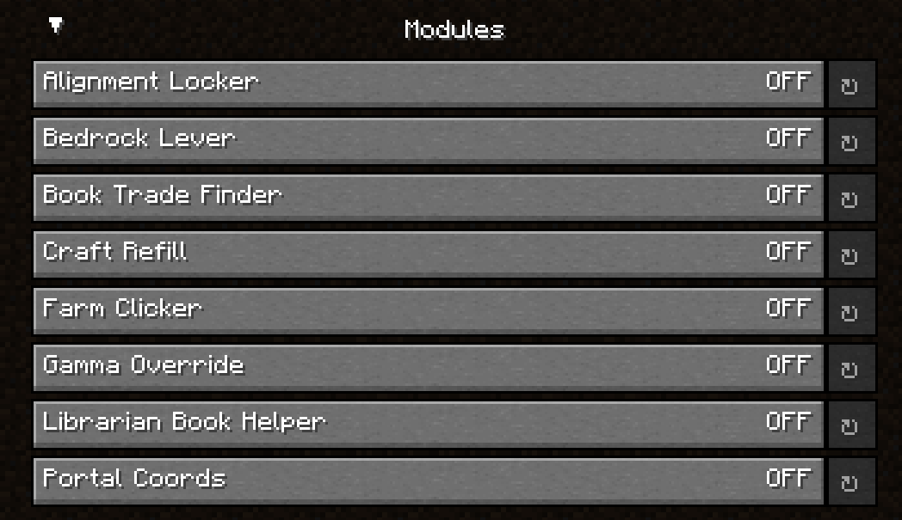

# Duncan's Tools

## What Is This Mod?

This mod adds various client side utilities and QoL improvements similar to a few Tweakeroo features and others. More
details about the modules can be found in the mod's config page.

This is a mod I made specifically for myself. All modules in the mod are tools that I would actually use.

I made this mod because I found a lot of the features of existing similar mods don't quite match what I'm looking for,
or features that I'm looking for simply don't exist in any other mods.

## Sharing with the World

This is a very biased mod, but still contains lots of things that others would find useful. Since a lot of the features
are bannable on a lot of servers, or could be considered outright cheating, **everything comes disabled by default:**

## Why No Modrinth or Curseforge???

This mod is highly opinionated and biased and comes with lots of cheaty stuff. It isn't suitable for modpacks and it
was really designed for technical survival players who don't need to download modpacks. For all these reasons, I do not
feel comfortable having this on distribution sites.